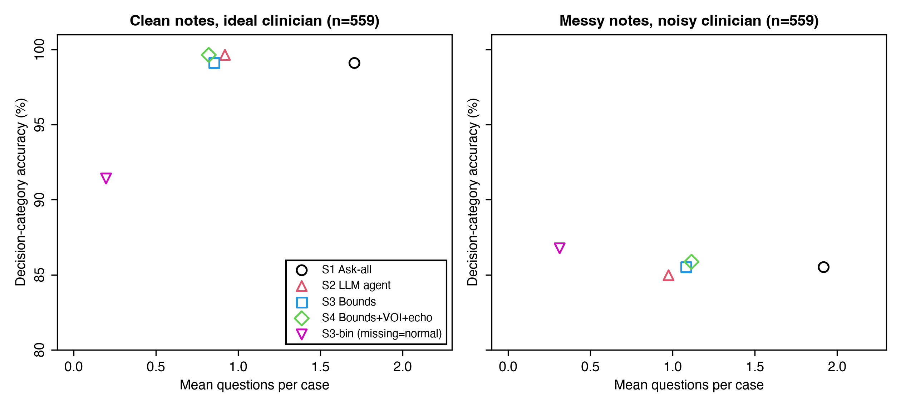
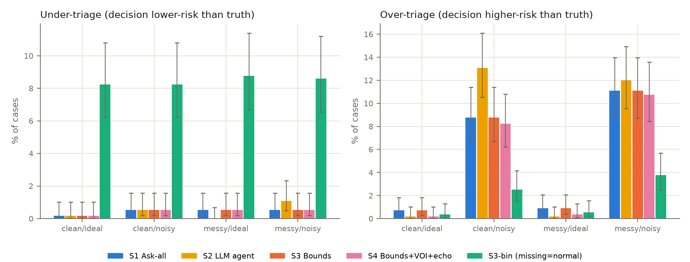
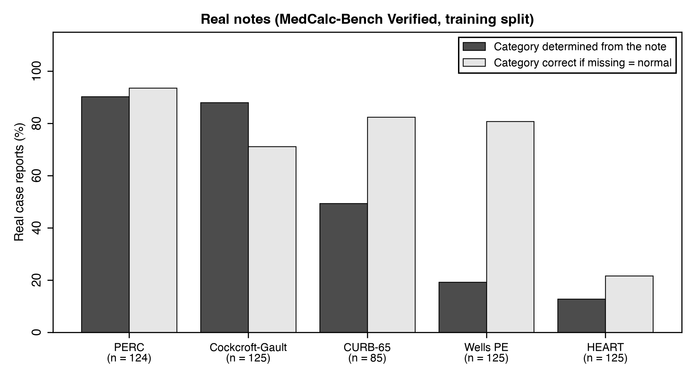

<!--
JAMIA "Research and Applications" draft. Limits: 4,000 words (excluding abstract,
references, tables and figure legends), structured abstract of 250 words, up to 4 tables and
6 figures. `paper/jamia/check.py` counts words and lists the [[MIMIC: ...]] placeholders that
must be filled from `results/mimic/` (aggregate tables only) before submission. Every number
from the synthetic study is taken from paper/tables/ (the arXiv v1 numbers).
-->

**Keywords:** clinical decision rules; large language models; missing data; information extraction; patient safety

## Abstract

**Objective:** To test whether separating language-model extraction from deterministic decision logic lets a system compute clinical risk-score categories from incomplete notes, asking clinicians only questions that can change the decision.

**Materials and Methods:** A language model labels each score input as present, absent or unknown; code computes the range of scores still possible and asks only about decision-relevant unknowns. On 1,200 synthetic emergency cases across six calculators (HEART, CURB-65, qSOFA, PERC, Wells, Cockcroft-Gault) with a simulated clinician, we compared this policy with asking for every missing input, treating missing as normal, and an end-to-end LLM agent. We then applied it, with local models only, to [[MIMIC: n cases]] emergency visits in MIMIC-IV, using the structured record as the clinician.

**Results:** The bounds policy matched ask-all accuracy (99.4% vs 99.4%) with half the questions (0.92 vs 1.78 per case) and no irrelevant ones. Treating missing as normal under-triaged 8.5% of patients (95% CI 7.1–10.2). With a noisy clinician the agent was less accurate (83.5% vs 87.0%, p<0.001) and committed prematurely in 2.7% of cases (bounds: 0%). In MIMIC-IV, the note alone determined the category in [[MIMIC: % (95% CI)]] of visits, and treating missing as normal under-triaged [[MIMIC: %]].

**Discussion:** Undocumented findings are common in real notes, and silently filling them with normal values under-triages patients.

**Conclusion:** Routing decisions through code that reasons about unknowns avoids premature commitment and irrelevant questions, and works with small local models.

## Background and Significance

Clinical scores such as HEART (chest pain), CURB-65 (pneumonia), qSOFA (suspected sepsis), PERC and Wells (pulmonary embolism) and Cockcroft-Gault (renal dosing) are defined over a few inputs with explicit thresholds. What matters clinically is usually the *decision category*, not the exact score: a HEART score of 0–3 is low risk, 4–6 moderate, 7 or more high. Large language models (LLMs) are now used to compute these scores from notes [@khandekar2024medcalc; @wang2025scores; @zhu2026medmcpcalc], and the standard benchmark, MedCalc-Bench, treats an input the note does not mention as absent or normal [@khandekar2024medcalc].

That convention is not neutral. "No mention of hemoptysis" is not "no hemoptysis", and a score computed as if it were can place a patient in a lower-risk category. The safe behaviour is to recognise when the documented facts do not determine the decision and then ask only for facts that could change it. LLMs handle this poorly in both directions, committing when the category is undetermined and abstaining when it is determined [@watanabe2026clindet], and interactive benchmarks show that models gathering information ask too little or too much [@li2024mediq; @schmidgall2024agentclinic; @johri2025craftmd].

ClinDet-Bench [@watanabe2026clindet] poses the determinacy question over score ranges but does not let a system ask; MediQ, AgentClinic and CRAFT-MD evaluate information seeking in diagnostic dialogue rather than calculators [@li2024mediq; @schmidgall2024agentclinic; @johri2025craftmd]. No study we know of measures, on real clinical records, how often the documented facts determine a score's category, or what treating missing inputs as normal does to triage.

## Objective

We test a simple division of labour (Figure 1). A language model reads the note into three-valued facts (present with a value, explicitly absent, or unknown), each with an exact evidence quote and a confidence. Deterministic code computes the range of scores still possible given the unknowns (the score's *bounds*), decides whether the category is determined, and if not asks only about unknowns that could change it. We pre-specified four hypotheses: (H1) the bounds policy asks far fewer questions than asking for every missing input at equal accuracy; (H2) an end-to-end agent both asks questions that cannot change the category and answers before the category is determined; (H3) three-valued extraction reduces silent missing-as-absent errors compared with a binary schema; (H4) confirming low-confidence, decision-critical values catches extraction errors at a small question cost. We then test the transferable claims on real records: how often real notes determine the category, whether treating missing as normal under-triages, whether the bounds policy remains sound, and whether a small local model suffices.

## Materials and Methods

### Calculators and bounds

The six calculators were implemented from their primary sources [@six2008heart; @lim2003curb65; @seymour2016qsofa; @singer2016sepsis3; @kline2004perc; @kline2008perc; @wells2000pe; @vanbelle2006christopher; @cockcroft1976creatinine], with decision categories HEART 0–3 / 4–6 / ≥7, CURB-65 0–1 / 2 / ≥3, qSOFA ≥2 positive, PERC negative if all criteria are met, Wells PE likely if >4, and Cockcroft-Gault <30 / 30–<60 / ≥60 mL/min. Where a source was ambiguous (for example, HEART troponin bands or the BUN equivalent of CURB-65 urea) we implemented a documented reading (Supplementary S1). Units are converted by code, never by the model. Numeric inputs are split into regions at the calculator's cut-points, and achievable scores are enumerated exactly over the regions (Cockcroft-Gault, which is monotone, is evaluated at interval corners). The category is *determined* when only one category is possible, and an unknown input is *decision-relevant* if its value changes the category for some completion of the other unknowns. For example, with 2 documented HEART points and troponin (0–2 points) unknown, the possible scores 2–4 span low and moderate risk, so troponin is asked; with 0 documented points they do not, and nothing is asked. Property-based tests [@maciver2019hypothesis] checked that every completion falls within the bounds and that inputs labelled irrelevant never change the category.

### Extraction

For every input the extractor returned a status, a value, a unit and the shortest exact supporting quote, plus a confidence. Code rejected any claim whose quote was not an exact substring of the note (the input then became unknown), converted units, and rejected implausible values. Extractors were an oracle returning the documented facts (a perfect-extraction reference), Claude Haiku 4.5 (schema-constrained output; self-reported confidence), and Qwen3.5-9B [@qwen35] run locally through Ollama [@ollama] (confidence from token log-probabilities). Confidence was calibrated by temperature scaling [@guo2017calibration] and isotonic regression [@zadrozny2002isotonic] on a 30% development split.

### Policies

*Ask-all* asks about every input left unknown. *Bounds* asks only decision-relevant unknowns, one at a time, recomputing the bounds after each answer. *Bounds + checks* adds value-of-information ordering and asks the clinician to confirm decision-critical values with calibrated confidence below 0.9. *Missing = normal* is the bounds policy with missing inputs treated as normal, the MedCalc-Bench convention. *Agent* is an end-to-end agent: Claude Opus 5.5 receives the note and the input list and, turn by turn, asks the clinician, runs the calculator, or answers (or declares the case undeterminable). When no question can settle the category, a policy abstains; for safety analyses an abstention becomes the highest-risk category still possible.

### Study 1: synthetic cohort

For each calculator we sampled 200 patients from plausible emergency-department priors (Supplementary S2). Each input was left undocumented with probability 0.3, and cases were resampled so that half had a category the note did not determine; results can be reweighted to the natural share (Supplementary S3). Cases carried traps: negations, values in other units, values from a previous visit, superseded readings, and comorbidities implied only by a medication. Claude Sonnet 5 wrote each note from a fact sheet, omitting undocumented inputs, including indirect cues. Every note passed rule checks and an independent LLM judge (Claude Opus 5.5) comparing each input with the ground truth (22 of 1,200 needed one retry). A "messy" end-of-shift version was rendered for 600 cases; 559 passed validation and form the paired set for harder conditions. A deterministic simulated clinician answered from the hidden truth; troponin was not yet available in 10% of cases. The noisy clinician could not answer 10% of questions, answered wrongly 5% of the time, and gave 25% of numeric answers as a ±10% range, fixed per case and input so that all policies face the same clinician. As an external check of the determinacy analysis we also used 584 published case reports from MedCalc-Bench Verified [@khandekar2024medcalc; @ye2025stewardship; @krohngrimberghe2026audit] for the five overlapping calculators.

### Study 2: real records (MIMIC-IV)

We used MIMIC-IV 2.2, MIMIC-IV-ED 2.2 and MIMIC-IV-Note 2.2 [@johnson2023mimiciv22; @johnson2023mimiciv; @johnson2023mimiced; @johnson2023mimicnote; @pollard2026physionet] under PhysioNet credentialed access. Cohorts were emergency visits followed by admission: pneumonia as principal diagnosis (CURB-65), suspected infection by the Sepsis-3 culture–antibiotic pairing (qSOFA), chest-pain chief complaint or emergency diagnosis (HEART), and creatinine with a recorded weight (Cockcroft-Gault). The structured record gave a partial ground truth: triage vital signs, first laboratory values within 24 hours of arrival, Glasgow Coma Scale, weight and body-mass index, and comorbidity codes. A value absent from the record stayed unknown, never absent. Judgement items (HEART history and electrocardiogram) were annotated by an emergency physician on [[MIMIC: n]] HEART cases. Glasgow Coma Scale is charted only for intensive-care stays, so confusion (CURB-65) and altered mentation (qSOFA) were usually absent from the record; the primary analysis left them unknown, and a secondary analysis added them as annotated from the note on [[MIMIC: n]] cases per calculator. The reference category was the one the structured record determined; visits whose record left it open had no reference.

MIMIC-IV-Note has no emergency-department notes, so the extractor read the discharge summary of the same admission, restricted to the sections closest to what was known on arrival (chief complaint, history of present illness, past medical, social and family history, admission examination and pertinent results); discharge examination, discharge results and hospital course were excluded. Because MIMIC-IV-Note masks ages, age and sex were taken from the structured record, as any electronic record shows them beside the note, and a urea value quoted as BUN was read in mg/dL by code. The same extraction prompt, parser and policies were used, with the structured record acting as the clinician: a question was answered with the recorded value, and "not available" meant the value was truly absent. To comply with the data use agreement, only local models processed note text (Qwen3.5 4B and 9B, Gemma 4 12B through Ollama); the agent arm, which requires a frontier model, was not run. Only aggregate results, with cells below 10 suppressed, left the local machine. Operational definitions (codes, item identifiers, time windows) are listed in Supplementary [[S-MIMIC]].

### Outcomes and statistics

Primary outcomes were decision-category accuracy, with abstention counted as incorrect, and questions per case. Secondary outcomes were under-triage (a lower-risk category than the truth) and over-triage; premature commitment (answering while the category was undetermined); irrelevant questions (whose answer could not change the category); silent missing-as-absent claims; extraction accuracy; and calibration. In MIMIC-IV, extraction was scored against the record by extracted state, and we report the share of visits whose category the note alone determined and whether the reference stayed within the note's bounds. Proportions have Wilson intervals [@wilson1927probable] and mean questions bootstrap intervals. Paired comparisons used exact McNemar [@mcnemar1947note] and Wilcoxon signed-rank tests, Holm-adjusted [@holm1979simple] across four pre-specified comparisons per condition.

### Use of AI and reproducibility

LLMs generated the synthetic notes and served as extractors, judge and agent, as described above. Code and analysis were developed with AI assistance (Claude Code); no MIMIC data was processed by any remote model. Each run is one configuration file with a fixed seed, every model call is cached, and all tables and figures regenerate without new model calls.

## Results

### Study 1: synthetic cases

**Ideal conditions (Table 1).** H1 was supported. The bounds policy matched ask-all accuracy with every extractor while asking 44–48% fewer questions (Haiku: 99.4% for both, 0.92 vs 1.78 questions; p<0.001). About half of ask-all's questions could not change the decision; the bounds policy asked none. The saving held at 10%, 30% and 50% missingness (34–49% fewer questions; Supplementary S3). H3 was supported: treating missing as normal reduced accuracy to 91.2–91.8% (p<0.001), answered before the category was determined in 39–49% of cases, and under-triaged 8.2–8.8% of patients, against 0.0–0.1% for the bounds policy. Qwen missed 17% of documented negatives but labelled them unknown, so they were asked rather than assumed, and as extractor it reached oracle-level accuracy (99.8%). H2 was partly supported: the agent was as accurate (99.6%) but asked more questions (0.99 per case, p<0.001), 9.5% of them irrelevant, and answered prematurely in 0.2% of cases. H4 was partly supported: confirmation raised Haiku accuracy from 99.4% to 99.7% with fewer questions overall, but the gain was not significant.

**Harder conditions (Table 1, Figures 2–3).** A noisy clinician cost every policy that asks 12–16 accuracy points, mostly through abstention. The agent became less accurate than the bounds policy (83.5% vs 87.0%, p<0.001) and committed prematurely in 2.7% of cases; the code policies never did. Missing = normal matched the bounds policy's overall accuracy under noise because it rarely asks, but it under-triaged 8.4–10.2% of patients in every condition (bounds policy: 0.0–0.5%). On messy notes, the agent reading the notes directly was more accurate than the bounds policy with Haiku (99.8% vs 98.6%, p=0.047).

**Table 1.** Main synthetic results with Claude Haiku 4.5 extraction, clean notes, all 1,200 cases, with an ideal and a noisy clinician. Accuracy counts abstention as incorrect. Under-triage: a lower-risk category than the truth, with undetermined cases assigned the highest-risk category still possible.

{{table:table_summary}}

**Published case reports (Figure 4).** Only 52% (95% CI 48–56) of 584 MedCalc-Bench case reports had a category determined by the documented facts, from 90% for PERC to 13% for HEART. Under the missing-equals-normal convention the category was correct for 69% of notes (HEART 22%).

### Study 2: MIMIC-IV

[[MIMIC: cohort flow — eligible visits, admitted, with discharge summary, analysed, per calculator (Table 2).]]

[[MIMIC: note alone — share of visits whose category the note determined, overall and per calculator, with 95% CI; reference within the note's bounds (Table 3, Figure 5).]]

[[MIMIC: missing = normal — accuracy, under- and over-triage against the structured reference.]]

[[MIMIC: policies with the record as clinician — questions per case, "not available" answers, premature commitment, irrelevant questions (bounds vs ask-all vs missing = normal).]]

[[MIMIC: extraction by local model size (4B, 9B, 12B) — agreement with the record by extracted state.]]

**Table 2.** [[MIMIC: cohort characteristics and flow per calculator.]]

**Table 3.** [[MIMIC: main outcomes per calculator, Qwen3.5-9B extraction.]]

![[[MIMIC: Figure 5 — share of visits determined by the note alone and under-triage under missing = normal, per calculator, MIMIC-IV vs synthetic vs case reports.]]](../figures/fig5_mimic.png)

## Discussion

The most consistent finding is a safety one: treating undocumented findings as normal under-triaged about one patient in twelve in every synthetic condition, including clean notes and a perfect clinician, gave the right category for only two-thirds of published case reports, and [[MIMIC: under-triaged x% of real emergency visits]]. Headline accuracy hides this, because a system that rarely asks rarely meets an unanswerable question. Letting the model only read, and code decide, removed premature commitment and irrelevant questions and halved the questions asked. A frontier agent was a strong baseline, as accurate under ideal conditions and more accurate than a small extractor on messy notes, so we do not claim the modular design is more accurate than a capable agent. Its advantages are that it never answers early, never asks an irrelevant question, has the lowest under-triage, is deterministic and auditable, and needs only a model that can read. That last property matters in practice: real records often cannot leave the institution, and in MIMIC-IV a local model on a laptop [[MIMIC: result]].

Our real-record results suggest that benchmarks filling missing inputs with normal values overstate how often a score can safely be computed from the note alone. The design relates to active feature acquisition [@saartsechansky2009active], selective prediction [@geifman2017selective] and partial evaluation [@jones1993partial], and executable guideline standards such as Clinical Quality Language [@hl7cql] and FHIR Clinical Practice Guidelines [@hl7cpg] are a natural home for the determinacy check: a rule engine that already holds the score's logic can return "undetermined, ask X" instead of a number.

**Limitations.** The synthetic notes are cleaner and more complete than real ones and were written by a model from the same family as the Claude extractor (an exploratory comparison suggested a same-family advantage of 3.2 points, 95% CI 0.4–6.4), so absolute synthetic accuracies are optimistic. In MIMIC-IV, the discharge summary is written after the stay and may contain information not available on arrival; only admitted visits have one; discharge codes undercount comorbidities, which leaves many HEART risk factors unknown; Glasgow Coma Scale is charted mainly in intensive care; and a reference category exists only where the record determines it. Disagreement between note and record can be an extraction error or a genuine difference. The clinician was simulated, or replaced by the record; a study with clinicians answering in real time is needed. Calculator readings and operational definitions were reviewed by [[one / two]] physician(s).

## Conclusion

Keep "unknown" distinct from "absent" end to end, let code decide whether the documented facts determine the decision, ask only what can change it, and fall back to the higher-risk category when information cannot be obtained. Benchmarks and products that fill missing inputs with normal values should report how often the note actually determines the category.

## Acknowledgments

None.

## Author contributions

NVZ conceived the study, implemented the software, reviewed the calculator definitions, annotated the MIMIC-IV judgement items, analysed the data and wrote the manuscript. [[Add co-author contributions, CRediT taxonomy.]]

## Funding

This research received no specific grant from any funding agency in the public, commercial or not-for-profit sectors.

## Conflicts of interest

None declared.

## Data availability

Code is available at https://github.com/nicoveraz/calc-bounds (MIT licence), archived at https://doi.org/10.5281/zenodo.23004726. The synthetic cohort regenerates from the configuration and seed. MIMIC-IV, MIMIC-IV-ED and MIMIC-IV-Note are available through PhysioNet to credentialed users who sign the data use agreement; the repository contains the cohort definitions and the aggregate results only. MedCalc-Bench Verified is available from its authors.

## Ethics

The synthetic study used no patient data. MIMIC-IV data are deidentified and their use was governed by the PhysioNet credentialed data use agreement; [[confirm: no additional ethics review required]].

## References

::: {#refs}
:::
